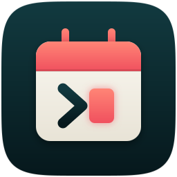
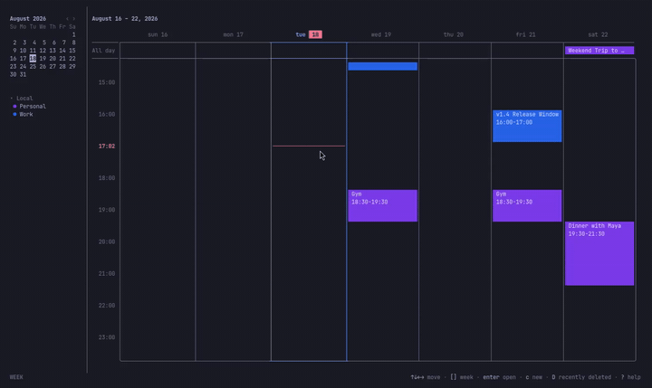
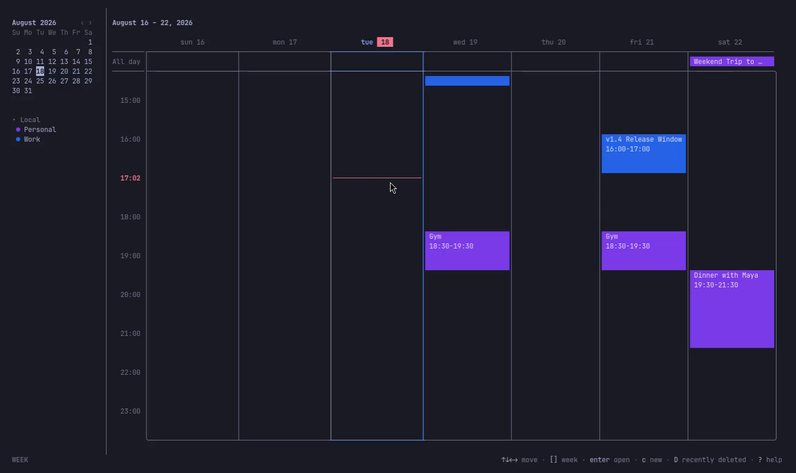
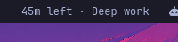
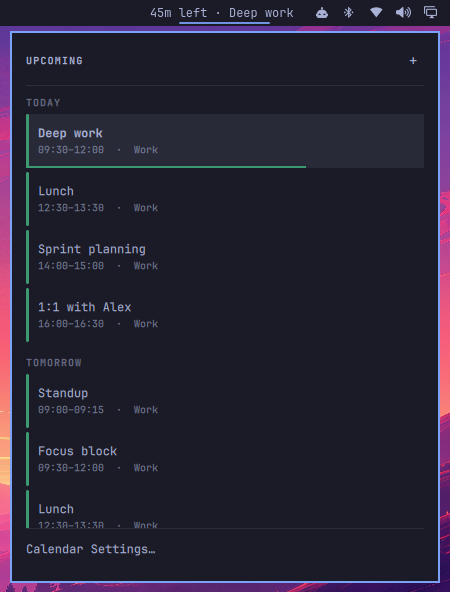
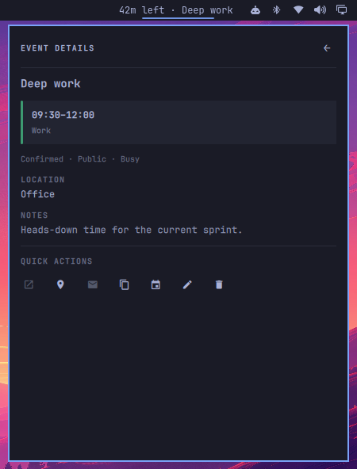

<p align="center">
  
</p>

# chroncal

[](https://github.com/DouglasdeMoura/chroncal/actions/workflows/ci.yml)
[](https://github.com/DouglasdeMoura/chroncal/actions/workflows/release.yml)
[](https://pkg.go.dev/github.com/douglasdemoura/chroncal)
[](https://goreportcard.com/report/github.com/douglasdemoura/chroncal)
[](LICENSE)

chroncal is a terminal calendar. SQLite stores the data. The program supports full iCal import and export, and CalDAV sync. Launch the TUI for an interactive calendar. Use the CLI to script access to events, todos, journals, alarms, free/busy queries, and calendars.

chroncal keeps your calendar data local and portable. The data follows the calendar standards.

<p align="center">
  
</p>

## Features

- **Interactive TUI** with month, week, day, and agenda views. Launch it on a given event with `chroncal --event`.
- **Omarchy menu bar** through [Chroncal Bar](https://github.com/DouglasdeMoura/chroncal-bar)
- **Full CLI** for scripts and automation
- **iCal import/export** with broad RFC 5545 coverage (VEVENT, VTODO, VJOURNAL, VALARM, VTIMEZONE)
- **CalDAV sync** with collection discovery, selective imports, access metadata, conflict resolution, sync health, and Google re-auth
- **Free/busy queries** from local data or remote CalDAV `VFREEBUSY` reports
- **Recurring events and todos** via RRULE, RDATE, and EXDATE
- **Recurring journals** via RRULE, RDATE, and EXDATE
- **Alarm notifications** with desktop alerts, sound, and email
- **Multiple calendars** with color codes
- **Full-text search** across events, todos, and journals
- **Attendees, attachments, comments, contacts, resources, and relations**
- **SQLite storage** with automatic migrations
- **Cross-platform** (Linux, macOS, Windows)
- **Two output formats**: text for humans, JSON for scripts and LLMs

## Installation

| Method | Platforms | Best for |
| --- | --- | --- |
| Install script | Linux, macOS, FreeBSD, OpenBSD | Prebuilt binary users who want one command |
| Homebrew | macOS, Linux | Managed installs and upgrades |
| Go install | Any platform with Go 1.25+ | Go users and contributors |
| mise | macOS, Linux | Users who already manage tools with mise |
| Nix | Linux, macOS | `nix run` and profile installs |
| Scoop | Windows | Managed Windows installs |
| AUR | Arch Linux | `yay`/`paru` users (binary or source package) |
| Build from source | Any platform with Go 1.25+ | Contributors and packagers |

### Install script (Linux / macOS / BSD)

You do not need a Go toolchain. The installer detects your OS and architecture. It downloads the latest release archive. It verifies the archive against `checksums.txt`. It installs `chroncal` to `/usr/local/bin` when possible. If `sudo` is not available, it uses `~/.local/bin`.

```bash
curl -fsSL https://raw.githubusercontent.com/DouglasdeMoura/chroncal/master/scripts/install.sh | sh
```

Pin an exact version:

```bash
curl -fsSL https://raw.githubusercontent.com/DouglasdeMoura/chroncal/master/scripts/install.sh | env VERSION=v0.2.3 sh
```

Install somewhere else:

```bash
curl -fsSL https://raw.githubusercontent.com/DouglasdeMoura/chroncal/master/scripts/install.sh | env INSTALL_DIR="$HOME/.local/bin" sh
```

Do not set `VERIFY_CHECKSUM=0` unless your environment cannot run checksum tools. Checksum verification is the recommended path.

### Homebrew (macOS / Linux)

```bash
brew tap douglasdemoura/tap && brew install chroncal
```

Upgrade:

```bash
brew update && brew upgrade chroncal
```

Uninstall:

```bash
brew uninstall chroncal
```

chroncal ships as a Homebrew cask (prebuilt binary). On Linux this needs Homebrew 4.5+ (April 2025). That version added cask support. GoReleaser pushes the cask to `DouglasdeMoura/homebrew-tap` on each release when the `HOMEBREW_TAP_TOKEN` repository secret is set. Installs from the old formula move to the cask on `brew upgrade`.

If Homebrew is not available for a new release, use the install script, mise, Nix, or `go install`.

### Go install

You need [Go](https://go.dev/) 1.25+.

```bash
go install github.com/douglasdemoura/chroncal/cmd/chroncal@latest
```

Pin an exact release:

```bash
go install github.com/douglasdemoura/chroncal/cmd/chroncal@v0.2.3
```

`go install` puts the binary in `$(go env GOPATH)/bin/chroncal`. Put that directory on your `PATH`.

### mise

Install the latest GitHub release globally:

```bash
mise use -g github:DouglasdeMoura/chroncal
```

Pin an exact release globally:

```bash
mise use -g github:DouglasdeMoura/chroncal@0.2.3
```

If a new release does not appear yet, clear the mise GitHub release cache first:

```bash
mise cache clear
mise ls-remote github:DouglasdeMoura/chroncal
```

### Nix

Run without an install:

```bash
nix run github:DouglasdeMoura/chroncal
```

Install to your profile:

```bash
nix profile install github:DouglasdeMoura/chroncal
```

Build the package from a clone:

```bash
nix build .#chroncal
```

The flake exposes `packages.default`, `packages.chroncal`, `apps.default`, and a developer shell with Go, GoReleaser, golangci-lint, govulncheck, and sqlc.

### Scoop (Windows)

Windows users can install with:

```powershell
scoop bucket add chroncal https://github.com/DouglasdeMoura/scoop-bucket
scoop install chroncal
```

Upgrade:

```powershell
scoop update chroncal
```

GoReleaser generates the manifest. It pushes the manifest to `DouglasdeMoura/scoop-bucket` on each release.

### Arch Linux AUR

The project publishes two AUR packages:

```bash
yay -S chroncal-bin  # prebuilt Linux binary from GitHub Releases
yay -S chroncal      # builds from source with your local Go toolchain
```

`chroncal-bin` is fastest for x86_64 and aarch64 users. Use `chroncal` when you want to build locally or use another Arch-supported CPU target. GoReleaser generates both packages (`aurs` and `aur_sources` in `.goreleaser.yml`). It pushes them to the AUR on each release.

### Build from source

```bash
git clone https://github.com/DouglasdeMoura/chroncal.git
cd chroncal
make build
./chroncal version
```

Run the test suite before you send changes:

```bash
go test ./...
```

### Maintainer checklist

Before you create a release:

1. Make sure CI passes on `master`.
2. Bump the `VERSION` file to the new version (no `v` prefix). The release workflow does not run if the file does not match the tag.
3. Run `goreleaser check` locally if GoReleaser is installed.
4. Create a `v*` tag. Push the tag.
5. Confirm the GitHub Release includes archives, `checksums.txt`, and install snippets.
6. Confirm the install script works for the new tag.
7. Confirm `brew tap douglasdemoura/tap && brew install chroncal` works after the Homebrew tap update.
8. Confirm `scoop update chroncal` sees the new Scoop manifest.
9. Confirm the AUR packages exist at <https://aur.archlinux.org/packages/chroncal> and <https://aur.archlinux.org/packages/chroncal-bin>.
10. Confirm `go install github.com/douglasdemoura/chroncal/cmd/chroncal@<tag>` works.
11. Confirm `mise use -g github:DouglasdeMoura/chroncal@<version>` resolves the release.

Do not rerun a failed release job while old assets still exist. GoReleaser does not overwrite release assets that already exist. The rerun fails with `already_exists` before it reaches the package publishers.

Delete the assets first. Then rerun the failed job. The release object and its notes stay. All channels then get hashes that match the new assets:

```bash
for a in $(gh release view vX.Y.Z --json assets --jq '.assets[].name'); do
  gh release delete-asset vX.Y.Z "$a" -y
done
gh run rerun <run-id> --failed
```

Required repository secrets:

| Secret | Purpose | Required |
| --- | --- | --- |
| `GITHUB_TOKEN` | GitHub Actions token. Publishes release assets. | Yes |
| `HOMEBREW_TAP_TOKEN` | Personal access token with write access to `DouglasdeMoura/homebrew-tap` | No. Homebrew updates need this token. |
| `SCOOP_BUCKET_TOKEN` | Personal access token with write access to `DouglasdeMoura/scoop-bucket` | No. If it is absent, Scoop updates use `HOMEBREW_TAP_TOKEN` when that token has access. |
| `AUR_KEY` | Unencrypted SSH private key for the AUR maintainer account | No. Without it, the workflow skips AUR publish. |

The flake reads its version from the `VERSION` file. Nix needs no per-release edits. When `go.mod` or `go.sum` changes, the flake `vendorHash` must change with it. The Nix CI workflow builds the flake on any PR that changes those files. The build fails on a mismatch.

To fix a mismatch, run `nix build .#chroncal`. Copy the `got:` hash into `flake.nix`. Then run the build again. The `update-flake-lock` workflow opens a PR that refreshes the flake inputs each month, on demand, and after a successful release workflow.

GoReleaser publishes all of these in one run: release assets, the Homebrew cask, the Scoop manifest, and both AUR packages. There are no manual package steps.

A later release can add `.deb` and `.rpm` assets with GoReleaser nFPM. Do this after the primary package manager channels are stable.

## Quick start

```bash
# Launch the interactive TUI
chroncal

# Open the TUI on a specific event (optional occurrence time)
chroncal --event 42
chroncal --event 42 --at 2026-04-17T14:00:00Z

# Create a calendar
chroncal calendar create "Work" --color "#3B82F6"

# Add an event
chroncal event add "Team standup" --date 2026-04-01 --time 09:00 --duration 30m --calendar Work

# Add a recurring event
chroncal event add "Weekly review" --date 2026-04-04 --time 14:00 --duration 1h --rrule "FREQ=WEEKLY;BYDAY=FR"

# Add a todo
chroncal todo add "Write quarterly report" --due 2026-04-15 --priority 1

# Add a journal entry
chroncal journal add "Weekly notes" --date 2026-04-04 --calendar Work

# List upcoming events
chroncal event list --from 2026-04-01 --to 2026-04-30

# Search
chroncal event search "standup"

# Import from iCal
chroncal ical import calendar.ics --calendar Work

# Export to iCal
chroncal ical export --calendar Work -f work.ics

# Add one CalDAV account; every usable calendar is discovered, imported, and synced
CHRONCAL_PASSWORD="…" chroncal account add "Work server" \
    --server https://cal.example.com/dav/ --username alice --auth basic
chroncal account calendars list "Work server"

# Run sync and inspect status
chroncal sync run --calendar Work
chroncal sync status

# Compute local free/busy for a range
chroncal freebusy --calendar Work --from 2026-04-01 --to 2026-04-30
```

## CLI reference

### Events

```
chroncal event list           [--from DATE] [--to DATE] [--calendar NAME] [--status STATUS] [--include-deleted]
chroncal event get            <id|uid> [--recurrence-id ID]
chroncal event search         <query> [--calendar NAME] [--from DATE] [--to DATE] [--status STATUS]
chroncal event add            "<title>" [flags]
chroncal event update         <id|uid> [flags] [--recurrence-id ID]
chroncal event rsvp           <id|uid> --status ACCEPTED|DECLINED|TENTATIVE
chroncal event delete         <id|uid> [--recurrence-id RFC3339] [--following RFC3339] [--series] [--yes]
chroncal event restore        <id|uid>
chroncal event purge          <id> [--yes]
chroncal event purge-deleted  [--older-than DURATION] [--yes]
```

Event flags: `--date`, `--time`, `--end-time`, `--duration`, `--timezone`, `--location`, `--description`, `--calendar`, `--status`, `--class`, `--transparency`, `--priority`, `--url`, `--categories`, `--geo`, `--rrule`, `--exdate`, `--rdate`, `--attach`, `--alarm`, `--attendee`, `--organizer`, `--contact`, `--resource`, `--comment`, `--related-to`

`event delete` supports three scopes for a recurring series. Pass the series by ID or UID:

- `--recurrence-id <RFC3339>` deletes one occurrence. chroncal writes an EXDATE on the master and deletes any override at that time.
- `--following <RFC3339>` deletes that occurrence and every following one. chroncal truncates the series at that date.
- `--series` deletes the master and all overrides.

The three flags are mutually exclusive.

`event rsvp` sets your RSVP status on an event:

```bash
chroncal event rsvp 42 --status ACCEPTED   # aliases: yes/y, no/n, maybe/m
```

The calendar needs an owner email (`calendar update --email`). You must be an invited attendee, not the organizer. The command writes the local attendee row. It does not send an iTIP reply.

### Todos

```
chroncal todo list           [--calendar NAME] [--status STATUS] [--all] [--from DATE] [--to DATE] [--include-deleted]
chroncal todo get            <id|uid> [--recurrence-id ID]
chroncal todo search         <query> [--calendar NAME] [--status STATUS] [--completed] [--incomplete]
chroncal todo add            "<summary>" [flags]
chroncal todo update         <id|uid> [flags] [--recurrence-id ID]
chroncal todo complete       <id|uid> [--recurrence-id ID]
chroncal todo delete         <id|uid> [--recurrence-id ID] [--series] [--yes]
chroncal todo restore        <id|uid>
chroncal todo purge          <id> [--yes]
chroncal todo purge-deleted  [--older-than DURATION] [--yes]
```

Todo flags: `--due`, `--start`, `--duration`, `--location`, `--description`, `--calendar`, `--status`, `--progress`, `--class`, `--priority`, `--url`, `--categories`, `--geo`, `--rrule`, `--exdate`, `--rdate`, `--attach`, `--alarm`, `--attendee`, `--organizer`, `--contact`, `--resource`, `--comment`, `--related-to`

### Journals

```
chroncal journal list           [--from DATE] [--to DATE] [--calendar NAME] [--status STATUS] [--all] [--include-deleted]
chroncal journal get            <id|uid> [--recurrence-id ID]
chroncal journal search         <query> [--calendar NAME] [--from DATE] [--to DATE] [--status STATUS]
chroncal journal add            "<summary>" [flags]
chroncal journal update         <id|uid> [flags] [--recurrence-id ID]
chroncal journal delete         <id|uid> [--recurrence-id ID] [--series] [--yes]
chroncal journal restore        <id|uid>
chroncal journal purge          <id> [--yes]
chroncal journal purge-deleted  [--older-than DURATION] [--yes]
```

Journal flags: `--date`, `--description`, `--calendar`, `--status`, `--class`, `--url`, `--categories`, `--rrule`, `--exdate`, `--rdate`, `--attach`, `--attendee`, `--organizer`, `--contact`, `--comment`, `--related-to`

### CalDAV accounts

```
chroncal account add              "<name>" --server URL --username USER [--auth {basic,bearer,oauth2}] [--oauth-client-id ID] [--allow-insecure]
chroncal account get              <name|id>
chroncal account list
chroncal account update           <name|id> --name NAME
chroncal account credentials      <name|id>
chroncal account reauth           <name|id> [--oauth-client-id ID]
chroncal account calendars list   <name|id>
chroncal account calendars add    <name|id> (--calendar NAME_OR_URL ... | --all)
chroncal account calendars set    <name|id> (--calendar NAME_OR_URL ... | --all | --none) [--default ID_OR_NAME_OR_URL] [--yes]
chroncal account remove           <name|id> [--yes]
```

An account stores one credential. It discovers every CalDAV calendar collection that the credential can reach. `account add` imports every collection that supports `VEVENT`, `VTODO`, or `VJOURNAL`. It completes an initial sync before it returns.

`account calendars list` refreshes the complete inventory. The list includes selected, read-only, unsupported, and no-longer-available collections. `account calendars add` is additive and idempotent for collections that appear later. Use `--calendar` more than once to add chosen collections. Use `--all` to add every usable collection. The command syncs new collections before it returns.

`account calendars set` replaces the exact local selection. After confirmation, Chroncal deletes deselected calendars and their downloaded data. It never deletes the remote collections. If you deselect the current default calendar, pass `--default` with a retained local calendar or a new remote collection. The command syncs new collections before it returns.

If you select none, the command also removes the empty account and credential. `account remove` deletes the credential and remote links. It keeps downloaded calendars as local copies.

`account credentials` rotates the stored secret of a basic or bearer account. It reads the new value from `CHRONCAL_PASSWORD` (basic) or `CHRONCAL_BEARER_TOKEN` (bearer). `account reauth` repeats the Google OAuth consent flow for an oauth2 account; the client secret comes from `GOOGLE_CLIENT_SECRET` or the stored value, and `--oauth-client-id` replaces the stored client ID. Neither command accepts a secret as a CLI flag.

You can open read-only collections locally and sync them pull-only. Chroncal does not send metadata changes, resources, or tombstones to them.

### Calendars

```
chroncal calendar list
chroncal calendar get     <id>
chroncal calendar create  "<name>" [--color HEX] [--description TEXT] [--email ADDR] [remote flags]
chroncal calendar update  <id|name> [--name NAME] [--color HEX] [--description TEXT] [--email ADDR] [remote flags] [--disconnect-remote]
chroncal calendar delete  <id>
chroncal calendar set-default <id|name>
chroncal calendar hide     <id|name>
chroncal calendar show     <id|name>
```

`set-default` makes a calendar the default. New events, todos, and journals without an explicit `--calendar` go there. Exactly one calendar is the default at any time.

`calendar hide` opts a calendar out of the TUI sidebar without deleting it: events stay in the database and still sync. `calendar show` reverses it. Calendar JSON (`--output json`) carries the link and sync state per calendar: `account_id`, `account_name`, `remote_url`, `remote_access`, `last_sync_at`, `last_sync_error`, and `hidden`.

You can still use remote flags with `create` or `update` to attach one local calendar to a known CalDAV collection. Prefer `chroncal account` when one credential exposes multiple collections:

```
--remote-url <href>
--username <user>
--auth {basic,bearer,oauth2}
--oauth-client-id <id>
--allow-insecure
```

For script setup, the commands read credentials from environment variables, not from prompts: `CHRONCAL_PASSWORD` (basic), `CHRONCAL_BEARER_TOKEN` (bearer), and `GOOGLE_CLIENT_SECRET` (oauth2). The commands do not accept these values as CLI flags.

Pass `--disconnect-remote` on `update` to remove the remote link of a calendar.

### iCal import/export

```
chroncal ical import  <file.ics> [--calendar NAME]
chroncal ical export  [--calendar NAME] [--from DATE] [--to DATE] [--category TEXT] [--status TEXT] [-f FILE] [--events] [--todos] [--journals]
```

Imports have size limits to reduce resource exhaustion from untrusted calendar data. `chroncal ical import` rejects `.ics` payloads larger than 8 MiB. It also rejects inline base64 attachments larger than 1 MiB decoded.

### Sync

```
chroncal sync run       [--calendar NAME] [--account NAME] [--conflict MODE]
chroncal sync status
chroncal sync conflicts
chroncal sync resolve   <id> --pick {local,server}
chroncal sync reset     [--calendar NAME]
```

Sync runs on each connected calendar on its own. Calendars that share an account reuse its credential and sync one after another. Distinct accounts can sync at the same time. Use `chroncal account calendars list` and `chroncal account calendars add` to inspect and import remote collections. Use the calendar remote flags above when you attach one known URL.

Narrow a run with `--calendar NAME` (one local calendar) or `--account NAME` (every calendar linked to one CalDAV account). The two flags are mutually exclusive. An account with no linked calendars is a clean no-op.

### Google Calendar via CalDAV

Google Calendar requires OAuth 2.0. It only exposes `VEVENT` over CalDAV.

The OS keyring stores credentials by default. chroncal uses OAuth PKCE for installed-app flows. The Google token endpoint also requires the Desktop client `client_secret` even with PKCE. You need both the client ID and the client secret at setup time. After the first authorization, the keyring stores refresh tokens and the client secret. Later syncs then run with no prompt.

> **Plaintext fallback warning.** Install a keyring provider (for example `libsecret` + `gnome-keyring` on Linux) before you use OAuth on a shared host or a host with backups. On a system with no OS keyring, `--allow-plaintext` writes credentials (and the Google `client_secret`) to a 0600-mode file under `~/.config/chroncal/`. The mode blocks a casual `cat`. It does not block backups, filesystem snapshots, or sync tools (Dropbox, iCloud, rsync) that ignore Unix permissions.

1. Create a **Desktop app** OAuth client in the [Google Cloud Console](https://console.cloud.google.com/apis/credentials). Record the client ID and the client secret.
2. Add `https://www.googleapis.com/auth/calendar` to the OAuth consent screen. Add yourself as a Test user while the app is in Testing mode.
3. Enable **both** APIs on the project. They are separate services:

   ```bash
   gcloud services enable calendar-json.googleapis.com --project=YOUR_PROJECT
   gcloud services enable caldav.googleapis.com         --project=YOUR_PROJECT
   ```

   The Calendar JSON API alone is not enough. The CalDAV endpoint returns `403 accessNotConfigured` until you enable `caldav.googleapis.com`.

4. Add the Google account. Provide the client secret with the `GOOGLE_CLIENT_SECRET` environment variable, or let chroncal prompt for it (echo disabled). The command does **not** accept the secret as a CLI flag. Flags leak through process listings and shell history.

   ```bash
   GOOGLE_CLIENT_SECRET="GOCSPX-…" chroncal account add "Google" \
     --server "https://apidata.googleusercontent.com/caldav" \
     --username "you@example.com" \
     --auth oauth2 \
     --oauth-client-id "YOUR_CLIENT_ID.apps.googleusercontent.com"
   ```

5. The add command imports every usable calendar in the Google CalendarList. It then runs the first sync. This includes delegated, family, holiday, and subscription calendars. Inspect the inventory:

   ```bash
   chroncal account calendars list "Google"
   ```

6. Run sync and inspect the status:

   ```bash
   chroncal sync run
   chroncal sync status
   ```

To connect from the TUI, press `C` (`Shift+C`) or choose **Calendars** in the command palette (`/` or `Ctrl+K`). Activate the bottom **+ Add** action. Then choose **Add Account…**. Chroncal discovers, imports, and syncs every usable collection for that sign-in. There is no second selection step. Chroncal ignores unsupported collections.

If discovery finds no usable calendars, Chroncal removes the new account. Browser authorization runs inside the app. The same **+ Add** menu creates local calendars and imports iCal files. Remote calendars belong to an account. They do not carry separate credentials.

Account maintenance has one entry point. In **Calendars**, select a remote account heading and press `Enter`. Select an account heading in the sidebar to open the same inspector. The inspector shows the provider, server URL, login identity, calendar count, and sync warnings. Actions let you sync now, add or remove calendars, rename the account, sign in again for OAuth accounts, or remove the account.

**Manage Calendars…** replaces the inspector with the discovered collection list. The calendar hierarchy stays mounted. Calendars already in Chroncal start checked. If you uncheck one, Chroncal removes the local copy after destructive confirmation. If you remove every collection, Chroncal also removes the empty account and its stored credential.

**Remove Account…** removes the remote links and stored sign-in. It keeps downloaded calendars as local calendars. Calendar metadata edits are inline: name, color, description, owner email, default status, and quiet account/sync context.

Google limitations:

- Google CalDAV only supports `VEVENT`. Use Nextcloud, Radicale, or Fastmail for `VTODO` and `VJOURNAL`.
- Google paginates large `sync-collection` REPORT responses (RFC 6578 §3.6). It returns a `507` marker plus a continuation token. chroncal follows the pages and applies the union. The first sync of a large calendar then pulls every event.
- If account add lists calendars but the first sync returns HTTP 403, enable `caldav.googleapis.com` on the Google Cloud project. The Calendar JSON API is not enough.
- A failed calendar-color PROPFIND does not block event sync. Google colors come from CalendarList. Local Google color edits are written back through CalendarList, not Apple `calendar-color`.

### Free/busy

```
chroncal freebusy --calendar NAME --from DATE_OR_RFC3339 --to DATE_OR_RFC3339 [--remote] [--format {text,ical}]
```

Without `--remote`, `freebusy` computes busy time from local recurring data. With `--remote`, it sends a CalDAV free-busy report to the linked remote calendar.

### Alarms

```
chroncal alarm check                          # Fire due alarms (one-shot)
chroncal alarm list                           # List unacknowledged alarms
chroncal alarm dismiss  <state-id>            # Dismiss a fired alarm
chroncal alarm snooze   <state-id> [--for DURATION] [--until-start]
chroncal alarm daemon   [--interval DURATION] # Run alarm checks in a loop (default: 30s)
chroncal alarm missed   [--days N]            # Show missed alarms (default lookback: 7 days)
```

Attach alarms with `--alarm` when you create or update events and todos (repeatable). The format is `[ACTION:]TRIGGER[:DESC:REPEAT:DURATION:RELATED:ATTENDEES]`. ACTION is `DISPLAY` (default), `EMAIL`, or `AUDIO`. TRIGGER is an RFC 5545 duration relative to the start (`-PT15M` = 15 minutes before) or an RFC 3339 absolute time. Only the trigger is required:

```bash
chroncal event add "Standup" --date 2026-06-15 --time 09:00 --alarm "-PT15M"
chroncal event add "Release" --date 2026-06-15 --time 14:00 --alarm "DISPLAY:-PT30M::3:PT5M"  # repeat 3x every 5 min
```

See `chroncal event add --help` for the extra fields.

A synced calendar can hold an alarm this app does not fire. A server sends
one as a "no reminder" sentinel, and another client sends one with its own
action, such as `X-APPLE-SOUND`. The `--alarm` flag has no syntax for those
actions, so `chroncal event update` and `chroncal todo update` keep the
stored rows. Without that rule, a routine reminder edit deletes the alarm
of the other client from the server.

Pass `--clear-foreign-alarms` to delete them. Use the flag with `--alarm`
to make the new list the whole list. Use the flag on its own to remove the
stored rows and keep the alarms you can state:

```bash
chroncal event update 12 --clear-foreign-alarms              # remove them, keep your own
chroncal event update 12 --alarm "-PT30M" --clear-foreign-alarms  # the new alarm is the only one
```

#### Receive notifications

A stored alarm does not fire on its own. Something must run `chroncal alarm check` on a schedule. Two options:

1. **Background service (recommended):** `chroncal service install` sets up a user-level systemd timer (Linux), launchd agent (macOS), or Scheduled Task (Windows). The unit ticks every minute. No terminal needs to stay open.
2. **Foreground loop:** `chroncal alarm daemon` checks every 30 seconds until you interrupt it. Use this for tests or a tmux session.

With either option in place, a `DISPLAY` alarm shows a desktop notification at trigger time (15 minutes before the event in the example above). `AUDIO` alarms also play a sound. `EMAIL` alarms send mail. See [SMTP (for email alarms)](#smtp-for-email-alarms) and the `security.allow_unsafe_alarm_*` config options. If nothing appears, check [Desktop notification backends](#desktop-notification-backends).

### Service (alarm background service)

```
chroncal service install              # Install service; syncs CalDAV every 15m by default
chroncal service run                  # Run one background-service cycle now (alias: tick)
chroncal service uninstall
chroncal service status
```

The installed unit runs `chroncal service run` every minute. That command fires due alarms. It also runs CalDAV sync when the configured sync interval is due. `chroncal service install` defaults that interval to 15 minutes. Pass a different interval to change it:

```bash
chroncal service install --sync-interval 5m
```

Set `sync.interval` in `config.toml` to change the default for later installs. Pass `--sync-interval ""` at install time to disable background sync and keep alarm checks.

### Global flags

All commands accept `-o, --output {text,json}` (default: text).

The bare `chroncal` launch command also accepts `--event <id|uid>`, `--at <RFC3339 or YYYY-MM-DD>`, and `--recurrence-id <RFC3339>`. These flags open the TUI on an event. See [TUI](#tui).

### Scripts and LLM use

The CLI is for shells and language models, not only for hand input. The agent-friendly path:

- Pass `-o json` (or `--output json`) on every read or write command. The shape is stable. It omits empty optional fields. Write commands return the new row so a script can capture the `id` / `uid`. This also applies to read commands. `sync status`, `sync conflicts`, `freebusy`, and `alarm list` all emit JSON arrays or objects under `-o json`. An empty result is `[]`, not prose.
- Timestamps in JSON are RFC 3339 UTC with a `Z` suffix (`2026-04-21T13:00:00Z`). Text mode prints in your local timezone. Only JSON uses UTC so cross-machine comparisons stay honest.
- `event list` and `event get` include attendees in JSON output. A generated occurrence of a recurring series keeps the attendee list of the master event.
- Check the exit code. `0` means success. A non-zero code means failure. Errors go to **stderr**, never stdout. `cmd -o json | jq …` is safe. On failure, stdout is empty.
- Errors honor `-o json`. They emit one JSON object on stderr with a `code` field:

  ```json
  {"code": "not_found", "error": "event 999 not found"}
  ```

  Codes are `not_found`, `invalid_input`, `aborted`, or `error` (catch-all). The `error` field is the user-facing message. The output strips internal call-chain prefixes (for example `get event:`). Dispatch on `code` and show `error` directly.
- References accept either the numeric `id` or the string `uid`. Commands take `--recurrence-id <RFC3339>` to address one instance of a recurring series. On `event delete`, the flag deletes that occurrence.
- Dates are `YYYY-MM-DD`. Times are `HH:MM` local unless a command accepts `--timezone`. Durations are Go-style (`30m`, `1h30m`). Some flags also accept RFC 5545 (`PT1H30M`).
- If you want plain text (no JSON), pass `--compact` for one line per row. That form works with `grep` and `awk`. It is available on `event list`, `event search`, `todo list`, `journal list`, and `calendar list`.

```bash
# Round-trip: create the event, then read it back
uid=$(chroncal event add "Demo" --date 2026-06-01 --time 09:00 --output json | jq -r .uid)
chroncal event get "$uid" --output json
```

### Destructive operations

`event delete`, `todo delete`, `journal delete`, and `calendar delete` prompt for confirmation before they destroy data. The prompt is skipped when any of these is true, so scripts can still run:

- `--yes` / `-y` is passed
- `CHRONCAL_ASSUME_YES=1` is set in the environment
- `--output` is `json` (machine-readable means scripted)

In a non-interactive shell without any of the above, the command refuses. It does not auto-confirm in silence.

### Soft-delete + restore

Events, todos, and journals use soft-delete by default. The row stays in the database with a `deleted_at` timestamp so you can restore it later. After a retention window (default 30 days), a background purge hard-deletes rows older than the cutoff.

```
chroncal event   restore <id|uid>
chroncal todo    restore <id|uid>
chroncal journal restore <id|uid>

chroncal event   purge-deleted [--older-than DURATION] [--yes]
chroncal todo    purge-deleted [--older-than DURATION] [--yes]
chroncal journal purge-deleted [--older-than DURATION] [--yes]
```

List soft-deleted candidates with `--include-deleted` on the related `list` command. In the TUI, press `D` to open the mixed "Recently deleted" dialog. The dialog covers all three resource types. `r` restores the cursor row. `x` purges it. Space toggles multi-select so you can restore or purge many rows.

## TUI

Run `chroncal` with no arguments to launch the interactive terminal UI.

<p align="center">
  
</p>

Pass `--event <id|uid>` to jump to the event's day and open its details. Every view starts on that day:

```bash
chroncal --event 42
chroncal --event standup-uid --at 2026-04-17T14:00:00Z
```

`--at` accepts an RFC 3339 timestamp or `YYYY-MM-DD`. It selects a generated occurrence of a recurring series. The details show the times of that occurrence, not the series start. Stored overrides take `--recurrence-id` with the series UID. `--at` requires `--event` and excludes `--recurrence-id`.

**Views**: month, week, day, agenda. Switch with `m`, `w`, `d`, `a`. Press `W` to switch the first day of the week between Sunday and Monday. The TUI stores the choice, the same way it stores the view. `ui.week_start` in `config.toml` sets the default before a stored choice exists.

The TUI can create, edit, view, and delete events. Event details include alarms, attendees, and attachments. Use `p` to copy event details. Use `u` to undo a delete.

The sidebar uses quiet, collapsible account sections. There is a separate **Local** section. Active calendars show an item-colored filled `●` circle. Hidden calendars show an outline `○` circle. Space or a click on the circle toggles visibility. Calendar colors stay on calendar rows, not on account headings.

On an account heading, `Left`/`Right` collapse or expand the section. `Enter` opens **Account settings**. `Shift+Up`/`Shift+Down` reorder complete remote-account sections. **Local** stays first. The same reorder keys move calendars only within their own account.

Hidden state and scroll apply to calendar rows, not to group headings. Read-only imported calendars stay browsable. They reject event edits and deletes.

**Calendars** opens an account-grouped manager. The calendar hierarchy is on the left. An inspector is on the right. Calendar rows keep visibility (a checkbox) separate from identity (the calendar-color dot). Space or the checkbox toggles the same visibility state as the sidebar circles.

Account headings collapse with Left/Right. Enter opens account settings. The root inspector keeps a calendar **Edit…** action or an account **Account Settings…** action at the bottom. Enter or a click on a calendar-row body opens metadata, export, default-calendar, and delete controls. The hierarchy stays mounted. Linked calendar details open account settings without a loss of unsaved calendar edits.

The source list has a bottom **+ Add** action. It opens an anchored menu for **New Calendar…**, **Add Account…**, and **Import Calendar File…**. Account connection signs in once and adds every usable remote calendar. iCal import keeps its preview and the selection of a compatible destination. Todo and journal management live in the CLI for now.

A calendar whose last sync failed shows a `⚠` next to it in the sidebar. Open it to see why and to get a fix. See [Google Calendar via CalDAV](#google-calendar-via-caldav) for the OAuth flow.

## Configuration

Configuration loads in this order of precedence:

1. **Environment variables** (prefix `CHRONCAL_`, e.g., `CHRONCAL_DB`)
2. **Config file** at `$XDG_CONFIG_HOME/chroncal/config.toml` (or `~/.config/chroncal/config.toml`)
3. **Defaults**

### Config keys

| Key | Description | Default |
|-----|-------------|---------|
| `db` | Path to SQLite database | `$XDG_DATA_HOME/chroncal/chroncal.db` |
| `product_id` | iCal PRODID for export | `-//chroncal//chroncal//EN` |
| `ui.theme` | Built-in TUI theme name under `internal/tui/themes/` (`system` or `default`; see [TUI themes](#tui-themes)) | `system` |
| `ui.week_start` | First day of the week in the TUI month view, week view, and mini-calendar (`sunday` or `monday`) | `sunday` |
| `soft_delete.purge_days` | Days to keep soft-deleted rows before the background purge. `0` disables automatic purge. | `30` |
| `sync.interval` | Minimum interval between background CalDAV syncs that `chroncal service run` performs. `service install` defaults to `15m` when this is unset. | (unset — no sync unless the installed service sets `CHRONCAL_SYNC_INTERVAL`) |
| `sync.conflict_strategy` | Default conflict-resolution mode when you do not pass `sync run --conflict` | (unset) |
| `security.allow_unsafe_alarm_audio_attach` | Allow AUDIO alarms to attach arbitrary URIs. Off by default. | `false` |
| `security.allow_unsafe_alarm_email_attendees` | Allow EMAIL alarms to send to unverified attendee addresses. Off by default. | `false` |

Every key is also available as an environment variable (`CHRONCAL_` prefix, dots become underscores). Examples: `CHRONCAL_UI_THEME`, `CHRONCAL_UI_WEEK_START`, `CHRONCAL_SOFT_DELETE_PURGE_DAYS`, `CHRONCAL_SYNC_INTERVAL`.

### TUI themes

The TUI ships two built-in themes:

- **`system`** (default) — Chrome (text, borders, surfaces, dim text) inherits the terminal ANSI palette (`color0..15`). The TUI then follows themed terminal setups such as [Omarchy](https://learn.omacom.io/2/the-omarchy-manual/52/themes), Catppuccin, Gruvbox, Tokyo Night, or any setup that paints the standard 16 colors. The row-selection highlight adapts to the live terminal background via OSC 11. Accent colors (buttons, badges, "today", errors) sit on a fixed Dracula palette. Text-on-accent contrast then stays guaranteed across themes.
- **`default`** — Fixed designer palette (violet primary, sky secondary, emerald accent) with light and dark variants. This theme ignores the terminal palette. Pick this if you do not theme your terminal, or if you want the same look on every machine.

Override with `ui.theme = "default"` in `config.toml` or
`CHRONCAL_UI_THEME=default`.

### SMTP (for email alarms)

Configure with environment variables or `config.toml`:

```toml
[smtp]
host = "smtp.example.com"
port = 587
username = "you@example.com"
password = "app-password"
from = "you@example.com"
```

Or via environment: `CHRONCAL_SMTP_HOST`, `CHRONCAL_SMTP_PORT`, `CHRONCAL_SMTP_USERNAME`, `CHRONCAL_SMTP_PASSWORD`, `CHRONCAL_SMTP_FROM`.

### Desktop notification backends

`chroncal alarm check` records fired alarms even in headless environments. `DISPLAY` and `AUDIO` notifications still need an OS notification backend. On Linux that backend is a D-Bus notification daemon. GNOME and KDE include one. Lighter setups can use a standalone daemon such as `mako` or `dunst`.

On macOS and Windows (toast notifications), they work with no extra setup. On a minimal container or an SSH session with no desktop tools, notification delivery can fail. The alarm is still detected and listed by `chroncal alarm list`. Sound playback on Linux uses `paplay` (with `aplay` as fallback). macOS uses `afplay`. Windows has no sound-file playback, so `AUDIO` alarms show the toast with a system beep.

## Data storage

The database is a single SQLite file:

- **Linux**: `~/.local/share/chroncal/chroncal.db`
- **macOS**: `~/Library/Application Support/chroncal/chroncal.db`

Override with `CHRONCAL_DB` or the `db` config key.

Migrations run on startup. WAL mode is on for better concurrency.

Background jobs that run while the TUI owns the terminal write logs to a file, not to the screen. The soft-delete purge writes outcomes and failures to `$XDG_STATE_HOME/chroncal/chroncal.log`. The Linux default is `~/.local/state/chroncal/chroncal.log`. On macOS the state directory is `~/Library/Application Support`. The file grows by at most a few lines per day. The program does not rotate it.

## iCal compatibility

chroncal aims for complete RFC 5545 compliance. Current coverage:

- **VEVENT**: 30/31 properties (RSTATUS excluded, iTIP-only)
- **VTODO**: 31/32 properties (RSTATUS excluded, iTIP-only)
- **VJOURNAL**: core component import/export and CalDAV sync support
- **VALARM**: 7/7 properties, plus RFC 9074 UID support
- **ATTENDEE/ORGANIZER**: all 11 parameters
- **VTIMEZONE**: round-trip fidelity
- **VFREEBUSY**: local compute and export, plus remote CalDAV query support

Import from Google Calendar, Apple Calendar, Thunderbird, or any RFC 5545-compliant source. Export produces standards-compliant `.ics` files.

For safety, chroncal applies size limits to untrusted imports and inline attachments. It applies the limits before it stores the data locally or sends the data to linked CalDAV servers.

## CalDAV interoperability

Live interoperability QA ran against Nextcloud CalDAV with:

- `VEVENT`: create, update, delete, recurrence, timezone, conflict resolution
- `VTODO`: create, update, delete, recurrence, duration/start semantics, conflict resolution
- `VJOURNAL`: create, update, delete, recurrence, conflict resolution
- `VALARM`: round-trip sync on `VEVENT` and `VTODO`, with repeated alarms

Nextcloud does not expose a `VJOURNAL` collection by default. chroncal works with a dedicated CalDAV calendar created with `supported-calendar-component-set = VJOURNAL`.

## Omarchy

If you use [Omarchy](https://omarchy.org/), Chroncal can live on the menu bar and in the launcher.

### Menu bar

[Chroncal Bar](https://github.com/DouglasdeMoura/chroncal-bar) is an Omarchy plugin. It shows the current or next event on the bar. Left click opens the agenda. Middle click opens the next event URL. Right click refreshes.

<p align="center">
  
</p>

<p align="center">
  
</p>

<p align="center">
  
</p>

Install Chroncal first. Then add the plugin:

```sh
omarchy plugin add https://github.com/DouglasdeMoura/chroncal-bar.git --enable
omarchy bar move douglasdemoura.chroncal-bar --section right --after omarchy.tray
```

The second command is optional. It places the widget beside the tray.

Chroncal Bar talks to the Chroncal CLI. Recurrence authoring, CalDAV accounts, alarms, and the rest of Chroncal stay in the TUI.

### Launcher tile

Omarchy has a built-in command that turns a terminal app into a launcher tile. You do not have to write a `.desktop` file by hand. Point it at the chroncal icon. Then find the tile with **SUPER + SPACE**:

```bash
omarchy tui install chroncal chroncal float \
  https://raw.githubusercontent.com/DouglasdeMoura/chroncal/master/assets/chroncal-512.png
```

The four arguments are `name command window-style icon-url`. `float` opens chroncal in a centered floating window (Omarchy's `TUI.float` window rule). Pass `tile` instead to tile it like a normal window. The launcher runs chroncal through `xdg-terminal-exec`. It opens in the terminal that you configured. Nothing is hardcoded.

The icon is downloaded into `~/.local/share/applications/icons/`. It still works after the command finishes.

If you cloned the repo, point at the local vector master instead for a crisp icon at any size. The launcher references the file in place, so keep the file:

```bash
omarchy tui install chroncal chroncal float "$PWD/assets/chroncal.svg"
```

Remove the launcher later with `omarchy tui remove chroncal`.

## Desktop icon

chroncal ships an application icon under [`assets/`](assets/). The set is a vector master (`chroncal.svg`) plus raster PNGs from 16px to 512px. chroncal is a terminal app. You normally launch it by typing `chroncal` (or a shell alias), like `lazygit` or `lazydocker`. Use the icon when you want a graphical launcher tile.

### Other launchers (walker, rofi, GNOME, KDE)

On any other freedesktop setup, register the icon with a `.desktop` entry by hand:

```bash
# Install the icon into your user icon theme
install -Dm644 assets/chroncal.svg \
  ~/.local/share/icons/hicolor/scalable/apps/chroncal.svg

# Create a launcher entry that opens chroncal in your terminal
cat > ~/.local/share/applications/chroncal.desktop <<'EOF'
[Desktop Entry]
Type=Application
Name=chroncal
Comment=Terminal calendar
Exec=alacritty -e chroncal
Terminal=false
Icon=chroncal
Categories=Utility;Calendar;Office;
EOF
```

Swap `alacritty` for your terminal of choice (`ghostty`, `kitty`, `foot`, …).
The icon uses a deep petrol tile. That color keeps the silhouette visible against dark wallpapers such as the ones Omarchy ships. The icon stays readable in the launcher. It does not fade into the background.

## Contribute

See [CONTRIBUTING.md](CONTRIBUTING.md) for development setup, tests, and code conventions.

## Links

- [GitHub Repository](https://github.com/DouglasdeMoura/chroncal)
- [Chroncal Bar (Omarchy menu bar)](https://github.com/DouglasdeMoura/chroncal-bar)
- [Go Package Reference](https://pkg.go.dev/github.com/douglasdemoura/chroncal)
- [Issue Tracker](https://github.com/DouglasdeMoura/chroncal/issues)
- [Releases](https://github.com/DouglasdeMoura/chroncal/releases)
- [Contributor guide](CONTRIBUTING.md)
- [Security Policy](SECURITY.md)

## License

[MIT](LICENSE) - Douglas de Moura
